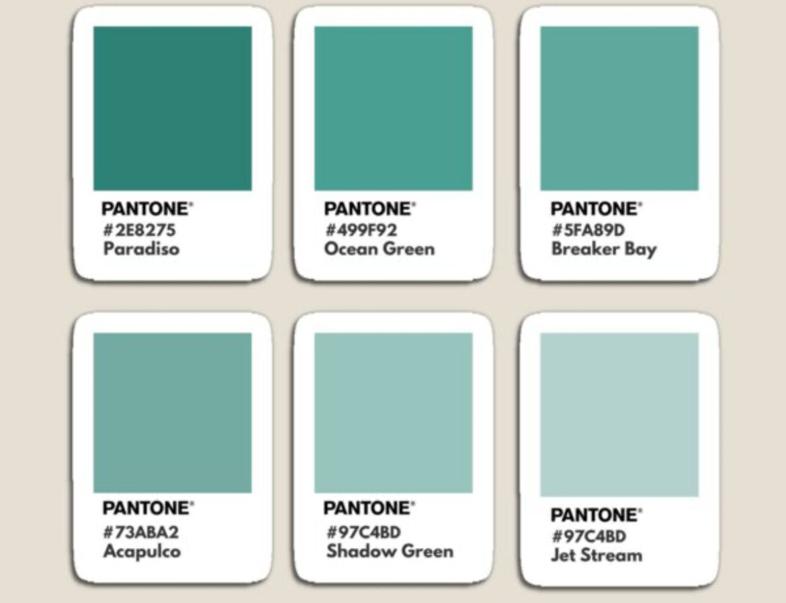
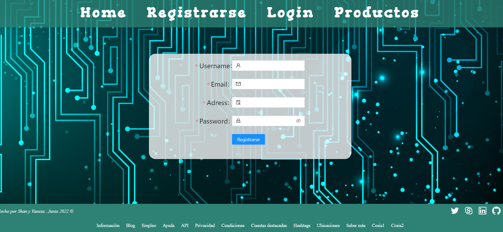
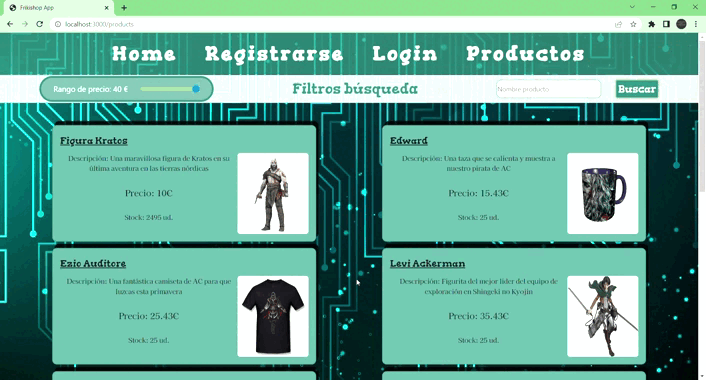

#  <center> :card_index: Proyecto React: Web de noticias :card_index: </center> 

 ## :clipboard: Índice :clipboard:

 - [Sobre el proyecto](#bookmarktabs-sobre-el-proyecto-bookmarktabs)

    - [Instalación y despliegue](#nutandbolt-instalación-y-despliegue)

    - [Tecnologías utilizadas](#wrench-tecnologiaspackages-utilizados)

    - [Origen](#dart-origen)

    - [Objetivos](#pushpin-objetivos)

    - [Inspiración](#cinema-inspiración)

- [Descripción del proyecto](#greenbook-descripción-del-proyecto-greenbook)


    - [Componentes](#2-componentes)


    - [Context](#2-componentes)

    - [Vista Admin]

    - [React router](#4-react-router)


- [Retos presentados](#dart-retos-presentados-dart)

  


- [Agradecimientos](#agradecimientos)

- [Futuras implementaciones](#blacknib-futuras-implementaciones-blacknib)

- [Autor](#raisedhands-autor-raisedhands)

------------------

# :bookmark_tabs: Sobre el proyecto :bookmark_tabs:


## :nut_and_bolt: Instalación y despliegue 
Para el desarrollo de este proyecto se ha utilizado React principalmente.
El proyecto se subirá a un repositorio público de GitHub.
Además, el backend procede de la API anteriormente creada para e-commerce online: [Frikishop API](https://github.com/vaneebg/BACKEND_FRIKISHOP).
Para instalar este proyecto debes hacer lo siguiente: primero acceder desde github a los dos repositorios y proceder a clonártelos con el siguiente comando:

git clone https://github.com/vaneebg/PROJECT-FRONTEND-FRIKISHOP
git clone https://github.com/vaneebg/BACKEND_FRIKISHOP

Una vez clonado el repositorio es muy importante que en tu consola instales todos los npm que necesita cada proyecto con el siguiente comando: 
````
npm i
````


Por último, procede a levantar el servidor primero en el proyecto de backend con este comando:
```
npm start
```
Y después en el proyecto de frontend, entras con cd my-frikishop/ y una vez dentro de la carpeta, levantas el servidor:
```
npm start
```

Automáticamente se te abrirá una nueva ventana del navegador con la página web.
## :wrench: Tecnologias/packages utilizados 
- Javascript
- React
- SASS
- Context
- UseReducer
- React Router
- Axios
- NodeJS
- MySQL
- Sequelize
- Bcrypt
- Jsonwebtoken
- Multer
- AntDesign


## :dart: Origen 
Es un proyecto fullstack de la academia The Brigde para asentar conocimientos sobre la utilización de React conjuntamente con context y useReducer, esta vez adaptado para trabajar con la API de backend que hemos creado anteriormente para un e-commerce, con lo cual se trabajan aptitudes anteriores, como el uso de Axios para llamar a nuestra API y el trabajo con NodeJS en caso de tener que modificar algo en la API para mejorar el funcionamiento. En lo referente al diseño, se ha seguido utilizando SASS y la librería AntDesign, que nos ha proporcionado tanto nofificaciones, como formularios e iconos entre otros.


Se ha trabajado en diversas ramas de Git para continuar con el proceso de aprendizaje de esta herramienta y fomentar las buenas prácticas. Primeramente se ha creado la rama develop y, como ha sido un trabajo en parejas, cada uno de nosotros dividía develop en varias subramas para trabajar desde ahí. Después cada uno mergeaba develop primero en su subrama, y una vez comprobado que todo seguía en funcionamiento, se mergeaba a develop y se subía a github para que el otro compañero pudiese hacer un pull para bajarse las nuevas implementaciones. Finalmente, una vez asegurado que todo e proyecto está en funcionamiento desde develop, se mergea a main.


 
## :pushpin: Objetivos 

**GENERALES:**

- [X] Registro de usuarios.
- [X] Login de usuarios.
- [X] Que se puedan ver los productos  y añadir al carrito de compra
- [X] Que se pueda crear pedidos
- [X] Que en tu perfil puedas ver tus datos
- [X] Uso de ramas con git, cuando se termine el proyecto deberán quedar dos ramas la master o main y la develop.
- [X] Presentación de README excelente.


**1.1.E-commerce( tienda online)**

- Componentes mínimos:
    - [X] Register
    - [X] Login
    - [X] Home
    - [X] Products
            - Product
    - [X] Perfil. Vista perfil con los datos del usuario logeado y sus pedidos
    - [X] Header
    - [X] Footer
- [X] Implementa React Router en tu página
    - /home. Home de la app
    - /login
    - /register
    - /profile. 
- [X] Utilizar Context 
- [X] Readme Excelente
- [X] Uso de SASS
- [X] Importante el diseño

*Reglas:*
- [ ] Los componentes no podrán sobrepasar las 400 líneas de código.
- [ ] Las funciones no deberán sobrepasar las 75 líneas de código.


## 1.2. Extras
- [ ] Frontend disponible en producción (ej:Heroku)
- [X] Buscador de productos
- [X] Implementación de filtros, por ejemplo que se pueda filtrar un producto por precio
- [X] El usuario con rol Admin pueda tiene una opción en el nav que le lleva a la vista Admin
- [X] Vista Admin donde se puede hacer el CRUD de productos (solamente si tienes el role Admin)
- [X] CRUD de los productos
- [X] Añadir o quitar un producto de favoritos
- [ ] Que el usuario pueda añadir reviews a un producto
- [ ] Que solo puedas editar y eliminar las reviews que tu creas.
- [ ] El usuario puede subir fotos en las reviews o cambiar su foto de perfil.
- [ ] El usuario puede dar likes a las reviews de los productos.
- [X] El usuario en su perfil puede ver sus pedidos
- [ ] Implementación de guards
- [/] Que sea responsive


-------------------
## :cinema: Inspiración 
La idea principal con la que se ha construido este proyecto es un diseño de cómic tal como ele componente Home indica. Al final hemos visto adecuado que, ya que setrata de una tienda friki, su diseño se adapte a estas características. Para ello, se ha utilizado principalmente una paleta de diversos verdes "geek" y también transparencias para la barra de navegación del header por ejemplo En el archivo colors.scss, están guardadas tanto la paleta de colores, como las dos fuentes principales que se han usado en la web en forma de variables:


Para el fondo general de la página, se ha escogido una imagen del mismo estilo con un attachment "fixed" para no tener los cortes de imagen y así ponerla estable en todo el fondo:


En Home hay una animación general de bienvenida que emula a las películas de Marvel:


En cuanto al diseño en general, tiene un diseño basado en tarjetas que están levemente pintadas con transparencia, por ejemplo el componente Register:




El el caso del componente Products presenta el mismo diseño, solo que son tarjetas coloreadas con efecto sombra y los filtros de búsqueda es una barra sticky que conforme bajemos se quedará fija con un leve efecto de transparencia:



Componente formulario:


Los cursores también se han personalizado para añadirle ese toque personal friki. En este proyecto he elegido a Zelda, por un lado la espada como cursor y por otro la cara de Link como pointer :smile:

----------
# :green_book: Descripción del proyecto :green_book:

## 1. API
Lo primero que debemos hacer es registrarnos en [Nytimes](https://developer.nytimes.com/apis). Después, justo como indica la documentación, nos dirigimos al apartado de perfil, a Apps y creamos una. Ahí al final, debemos activar qué secciones queremos descargar de la propia API:


En este caso, nos vamos a traer las noticias más populares de NYT. 
En cuanto a cómo acceder, en el apartado APIs de la propia web, seleccionando lo que nos interese, te muestran diferentes links con los que traer esa información. Lo único que hay que hacer es copiar nuestra key(la tenemos en el perfil) en la sección del link que pone 'yourkey'
`````
https://api.nytimes.com/svc/mostpopular/v2/viewed/1.json?api-key=yourkey
``````

Finalmente, haremos una petición Axios a ese mismo enlace:

``````
let url=`https://api.nytimes.com/svc/mostpopular/v2/viewed/1.json?api-key=${APIKEY}`
    const result = await axios.get(url);
``````

Esta llamada la encontraremos dentro de la carpeta context, en GlobalState, dentro de la función getNews.


----------

## 2. Componentes
Son un total de 5 componentes, cada uno de ellos enlazado a su fichero scss:


Dos de ellos se encuentran fijados para aparecer siempre independientemente del componente al que te hayas dirigido:
- Header: consta de 2 partes: por un lado, una barra de navegación con posición sticky semitransparente que te lleva a los apartados de la web. Por otro lado, está el título principal de la página "Noticiario casero made in VB".
- Footer: consta del nombre del autor junto con el año de creación. A mano derecha hay una serie de links dispuestos como iconos que redireccionan a las diferentes redes sociales (solo en funcionamiento real github y linkedin).
    Finalmente hay una serie de links no funcionales para simular el pie de página de varias webs.

- Form: Un formulario con diversos input, tanto tipo texto, como un select para asignar la sección de tu noticia y un input type:file para poder subir una imagen. Además, dentro del mismo está la siguiente función con el objetivo de guardar en el localStorage la información introducida en el formulario:
````
let writeNew = JSON.parse(localStorage.getItem("NEWS")) || [];
  const saveData=() =>{
       writeNew.push(data);
       localStorage.setItem("NEWS", JSON.stringify(writeNew));
     }
````

- ListNews: Se encarga principalmente de pintar las noticias que ha recibido de la API.

- Home: se encarga de pintar las noticias que se han ido almacenando en el localStorage mediante la siguiente función:
````
const newsBack = JSON.parse(localStorage.getItem("NEWS"));
````

-------

## 3. Context
La parte fundamental sobre la que se sustenta el trabajo. Tiene como objetivo globalizar la información (en este caso la que obtenemos de la API) para poderla utilizar luego en cualquier de nuestros componentes gracias a GlobalProvider. 
Aquí tenemos una función principal que es GlobalProvider, que engloba otra función llamada getNews, que se encargará de la llamada a la API y el almacenamiento de la información en nuestro initialState.

Primero, importamos todo lo que vamos a necesitar en las primeras lineas y después definimos un estado inicial donde news será una array vacía:

``````
const initialState = {
  news: []
};
``````

Creamos nuestro Context y GlobalProvider, donde entrará por parámetro 'children', que no son más que todos los componentes hijos que podrán heredar esta información global.
Después desestructuramos useReducer(que usará como parámetros AppReducer e initialState) en state y dispatch.
Por un lado, AppReducer tiene la función news mediante dos parámetros (state y action), continuando con un switch en este caso de un solo elemento que es GET_NEWS. Sin embargo, si por ejemplo tuviésemos un CRUD, aquí irían el resto de casos como por ejemplo PUT_NEWS:

```````
const news = (state, action) => {
    switch (action.type) {
        case "GET_NEWS":
            return {
                ...state,
                news: action.payload,
            };
        default:
            return state;
    }
};
export default news;
````````

A continuación creamos la función getNews en este caso, ya que queremos conseguir la información de la API, y en dispatch le ponemos que el tipo de 'envío' de la información va a ser GET_NEWS, y que su 'carga' será en este caso result.data.results. Ese mismo tipo es el que designa que en AppReducer se escoja un caso u otro, con lo cual entra en GET_NEWS, que te devolverá el estado ya cambiado, y las news serán esa misma 'carga' que hemos definido en payload.

Finalmente lo que retorna la función GlobalContext.Provider es un valor, compuesto por news, que será el estado cambiado de news, es decir, la array ya llena con nuestra información, y por la propia función getNews.
Por último, dentro de GlobalContext tendremos el parámetro que le pusimos a esta función, 'children', es decir, todos los componentes que se encuentren dentro de Global provider en App.jsx, compartirán esta información.

-----------

## 4. React router
Para la utilización de rutas en forma de Link en el proyecto, se instala este componente y se importa en nuestra App.jsx:
``````
import { BrowserRouter, Route, Routes } from "react-router-dom";
``````
Después, debemos poner todos los componentes entre los que queramos navegar dentro de estas etiquetas(<BrowserRouter>) y los path a las rutas dentro de Routes. Gracias a esto, ahora podemos navegar entre los componentes, un ejemplo de ello es la barra de navegación del componente Header`:
`````
<div className="nav">
      <Link to="/form">Crea tu noticia</Link>
      <Link to="/">Home</Link>
      <Link to="/listNews">Ver noticias</Link>
  </div>
``````
  --------------------
# :dart: Retos presentados :dart:
 ## Imágenes noticias
 Algunos problemas al pintar las noticias en html ya que algunas iban sin una imagen, por tanto al hacer el método map, presentaban 'undefined'. Con este condicional se soluciona el problema:
 ``````
 {
          notice.media.length !== 0 ?  : null
        }
``````
 ## Formularios con input file
Pese a que el input type=file sube las imágenes, al no estar usando una base de datos, sino que se están guardando en LocalStorage con un path, es complejo traerlas de nuevo al html.
## Documentación API
Cada API cuenta con un procedimiento diferente, por lo que hay que informarse previamente de cómo funciona y qué necesitas para traer los datos que quieres.
------------------------------
# :purple_heart: Agradecimientos :purple_heart:
A los profes [Sofía](https://github.com/SofiaPinilla) e [Iván](https://github.com/ivanpuebla10) por ayudarme a las validaciones y a [Germán](https://github.com/GeerDev) por la ayuda para las variables de entorno en React.
Y a todos mis compis de promoción por compartir momentos de risas y apoyo entre nosotros :smile: .
Especial mención a [Imanol](https://github.com/Imi21) por darnos suuuper peluchitos de compitruenos para la programación.
----------------
# :black_nib: Futuras implementaciones :black_nib:
- [ ] Responsive
- [ ] Creación de componentes hijos que dividan las funciones del componente padre.
- [ ] Pintar en html la imagen guardada en LocalStorage.
----------------------
# :raised_hands: Autor :raised_hands:
- :smiling_imp: [Vanesa Beltrán](https://github.com/vaneebg)